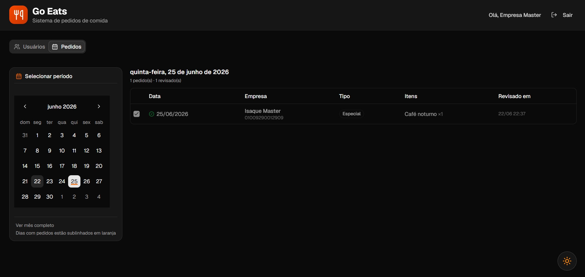

# Go Eats

Sistema web para gerenciamento e envio de pedidos de refeições corporativas.

O **Go Eats** foi desenvolvido como um **protótipo funcional** para a empresa **BR Foods**, com o objetivo de automatizar o processo de solicitação, organização e envio de pedidos de refeições (como desjejum, almoço, jantar, etc.) dentro de um ambiente corporativo. as

---

## Preview do Sistema

### Login


---

### Dashboard


---

### Registro de usuário


---

### Painel Administrativo


---
### Painel De Visualização de Pedidos



---
## Stack

**Frontend:** Next.js, React, TypeScript, TailwindCSS, Shadcn/UI

**Backend:** Next.js API Routes, Prisma ORM, PostgreSQL

**Testes:** Vitest, Playwright

**Infraestrutura:** Docker, Docker Compose

**Integrações:** Z-API (WhatsApp), Nodemailer, Cron Jobs


---

##  Rodando o projeto


```bash
npm install
npx prisma migrate dev
npm run dev
```

---

## Primeiro Acesso ao Sistema

Para acessar o sistema pela primeira vez é necessário criar manualmente um usuário administrador (`ADMIN`), pois não existe cadastro público de administradores.

### Criando o usuário administrador

1. Abra o terminal integrado do VS Code na raiz do projeto.

2. Gere o hash da senha desejada utilizando o Node.js:

```bash
node -e "const bcrypt=require('bcryptjs'); bcrypt.hash('SuaSenhaAqui',10).then(hash=>console.log(hash))"
```

Exemplo:

```bash
node -e "const bcrypt=require('bcryptjs'); bcrypt.hash('Admin123@',10).then(hash=>console.log(hash))"
```

Copie o hash gerado no terminal.

3. Abra o Prisma Studio:

```bash
npx prisma studio
```

4. Crie uma empresa na tabela `Company` preenchendo:

* `cnpj`
* `socialName`

5. Em seguida, crie um registro na tabela `User` utilizando:

| Campo          | Valor                                         |
| -------------- | --------------------------------------------- |
| `email`        | [admin@empresa.com](mailto:admin@empresa.com) |
| `passwordHash` | Hash gerado anteriormente                     |
| `role`         | `ADMIN`                                       |
| `companyId`    | ID da empresa criada                          |
| `isActive`     | `true`                                        |

Após salvar o registro, utilize o e-mail e a senha definidos para acessar o sistema.

---

## Cadastro de Usuários Operacionais

Após realizar o login com um usuário `ADMIN`, acesse o painel administrativo e utilize a funcionalidade **"Registrar novo usuário"** para cadastrar usuários operacionais.

Os usuários cadastrados pelo painel recebem automaticamente o papel:

```txt
USER
```

Usuários com perfil `USER` possuem acesso apenas ao painel de pedidos da empresa, podendo:

* Realizar pedidos de refeições;
* Criar pedidos agendados;
* Consultar seus pedidos;
* Gerenciar pedidos especiais.

Usuários `USER` não possuem acesso às funcionalidades administrativas do sistema.


---

## Rodando com Docker

### Pré-requisitos
- Docker Desktop instalado

### Subir aplicação

```bash
docker compose up --build
```

Ou em background:

```bash
docker compose up -d
```

A aplicação ficará disponível em:

```txt
http://localhost:3000
```

### Parar containers

```bash
docker compose down
```


---
##  Visão Geral


O sistema permite que usuários:

* Selecionem itens de refeição por categoria
* Escolham subcategorias (ex: bebidas → achocolatado, café, chá)
* Definam quantidades
* Enviem pedidos automaticamente
* Disparem pedidos via integração (WhatsApp ou e-mail)
* Automatizem pedidos recorrentes com base no dia anterior
* Sejam gerenciados por meio de um painel admistrativo

---


## Funcionalidades Principais

### Criação de Pedidos


* Interface intuitiva para seleção de refeições
* Suporte a:

  * Itens simples (sem subcategoria)
  * Itens com subcategorias
* Controle de quantidade por item ou subitem

---


### Resumo do Pedido

* Visualização em tempo real dos itens selecionados
* Edição de quantidades
* Remoção de itens ou subitens
* Contagem total de itens

---


### Persistência de Dados


* Pedidos são salvos no banco de dados via **Prisma ORM**
* Estrutura relacional com:

  * Usuários
  * Empresas
  * Pedidos
  * Itens
  * Subcategorias

---


### Envio de Pedidos

* Envio automático após criação
* Integrações disponíveis:

  * WhatsApp (via API externa)
  * E-mail (via SMTP / Gmail)

---


### Automação com Cron


* Rotina automática diária (8h)
* Caso o usuário não faça pedido no dia:

  * Sistema replica o pedido do dia anterior
  * Envia automaticamente

---


## Painel administrativo

  ### Funcionalidades:
   * Listagem de usuários cadastrados
   * Busca por e-mail, empresa e CNPJ
   * Filtro por perfil de acesso (Administrador ou Usuário)
   * Atualização de informações dos usuários
   * Exclusão de usuários
   * Indicadores resumidos em cards
   * Paginação no frontend para navegação entre páginas
   * Paginação no backend utilizando Prisma (`skip` e `take`)
   * Busca e filtros integrados à paginação
   * Atualização dinâmica dos dados utilizando React Query


---


### Autenticação

* Sistema de login com sessão
* Usuário vinculado a uma empresa
* Controle de acesso básico

---


## Tecnologias Utilizadas


### Frontend

* React
* Next.js (App Router)
* TypeScript
* Tailwind CSS
* Shadcn/UI
* Lucide Icons
* Zod (validação)

---

### Backend

* Next.js API Routes
* Prisma ORM
* PostgreSQL
* Node.js
* Supabase

---

### Integrações

* WhatsApp API (Z-API)
* Nodemailer (envio de e-mails)
* node-cron (tarefas agendadas)

---


## Estrutura de Dados (Resumo)


* **User**

  * Vinculado a uma empresa
* **Company**

  * Agrupa usuários e pedidos
* **Order**

  * Pedido por data e tipo de refeição
* **OrderItem**

  * Itens do pedido
* **Item**

  * Tipos de refeição
* **Subcategory**

  * Variações de itens

---

## Regras de Negócio

### 1. Um pedido por refeição/dia


Cada empresa só pode ter **um pedido por tipo de refeição por dia**:

```ts
@@unique([companyId, date, mealType])
```

---


### 2. Todos os itens devem ter o mesmo tipo de refeição

Não é permitido misturar:

* Almoço + Jantar no mesmo pedido

---

### 3. Subcategorias são opcionais


* Item simples → quantidade direta
* Item com subcategoria → quantidade por subitem

---


### 4. Pedido automático


Se o usuário não fizer pedido no dia:

* Sistema busca o pedido do dia anterior
* Replica automaticamente
* Envia via integração

---

### 5. Controle por empresa


* Cada usuário pertence a uma empresa
* Pedidos são organizados por empresa

---


## Fluxo do Sistema


1. Usuário faz login
2. Seleciona itens e quantidades
3. Sistema monta o pedido
4. Pedido é salvo no banco
5. Sistema envia automaticamente
6. (Opcional) Cron replica pedidos futuros

---


## Configuração de Ambiente


Crie um arquivo `.env` com:

```env
DATABASE_URL=
DIRECT_URL=

# WhatsApp (opcional)
ZAPI_INSTANCE_ID=
ZAPI_TOKEN=
ZAPI_PHONE=

# Email (opcional)
EMAIL_USER=
EMAIL_PASS=
```

---
---


##  Testes Automatizados

O projeto possui testes automatizados cobrindo regras de negócio, autenticação e fluxo de interface do usuário.

### Testes Unitários e de Integração — Vitest

Utilizado para validar regras de negócio, serviços e fluxos internos da aplicação.

#### Cenários testados

**Autenticação**
- Login com credenciais válidas
- E-mail inexistente
- Senha inválida

**Pedidos**
- Criação de pedidos
- Validação de itens
- Regras de negócio do pedido
- Controle de tipos de refeição

**Validações**
- Estruturas com Zod
- Tratamento de erros
- Regras de consistência

#### Executar testes

```bash
npm run test
```

Ou em modo watch:

```bash
npm run test:watch
```

---

### Testes End-to-End (E2E) — Playwright

Utilizado para simular o comportamento real do usuário dentro da aplicação.

Os testes E2E verificam desde o login até a interação completa no dashboard de pedidos.

#### Cenários E2E implementados

**Login**
- Login com sucesso
- Erro de usuário inexistente
- Erro de senha inválida

**Fluxo de Pedido**
- Botão "Fazer Pedido" inicia desabilitado
- Usuário consegue adicionar item disponível
- Botão é habilitado após interação válida

#### Particularidades dos testes

Os testes utilizam:

- **Banco de dados isolado para E2E**
- **Seed automática de usuário de teste**
- **Mock de horário do sistema**, permitindo testar disponibilidade de refeições por período do dia
- Limpeza automática dos dados antes da execução

#### Executar testes E2E

Modo headless:

```bash
npm run test:e2e
```

Modo visual:

```bash
npm run test:e2e -- --headed
```

Interface do Playwright:

```bash
npm run test:e2e -- --ui
```

---

##  Cobertura dos Testes

Atualmente o projeto possui cobertura para:

- Autenticação  
- Regras de login  
- Fluxo de criação de pedido  
- Estados da interface  
- Regras de disponibilidade por horário  
- Interações do dashboard

---


##  Status do Projeto

 Este projeto é um **protótipo**, podendo conter:

* Melhorias de arquitetura
* Ajustes de segurança
* Otimizações de performance

---


## Evoluções Futuras


* Relatórios de consumo
* Dashboard analítico com métricas de pedidos
* Integração oficial com WhatsApp Business API
* Notificações em tempo real
* Incluir a lógica de Queue no envio de email.
* Exportação de relatórios em PDF e Excel


